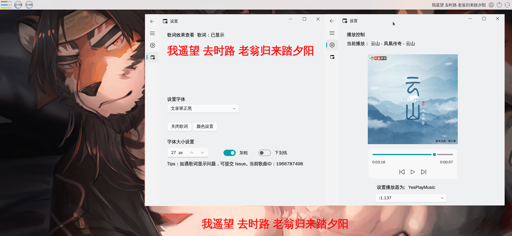

<h1 align="center">
  这是一个ReadMe
</h1>

这个项目刚开始开发，目前有亿点点Bug。是一个桌面歌词显示项目，基于PySide6开发，采用Fluent-Widgets作为UI界面,目前只支持显示来自yesplaymusic的歌词。

------------

### 展示


------------

### 环境搭建
  首先在本地创建新的 **conda** 环境
  ```
  conda create --name lyc python=3.9.18
  conda activate lyc
  pip install PySide6-Fluent-Widgets==1.3.3 -i https://pypi.org/simple/
  pip install pyside6==6.5.2
  pip install dbus-python
  pip install pympris
  ```
克隆本项目到本地并克隆模块

然后在命令行输入
```
cd “克隆的项目位置”
conda activate lyc
python my_window.py
```
------------

### 关于项目引用和参考
- UI 基于 [Fluent-Widgets](https://github.com/zhiyiYo/PyQt-Fluent-Widgets) 设计。
- 引用了 [ypm-lyrics-backend](https://github.com/LiYulin-s/ypm-lyrics-backend) 库，由于有修改单独开源到[ypm-lyrics-backend](https://github.com/ghhccghk/ypm-lyrics-backend)。
- 使用了来自[pympris](https://github.com/wistful/pympris)库。
- 参考了[呆啵宠物 (DyberPet)](https://github.com/ChaozhongLiu/DyberPet) UI写法

------------

### 关于部分图片版权声明
- 在本项目下 res/icons/108.png 属于我个人版权，未经允许，拒绝商业使用。如需商用本项目请替换图片。
